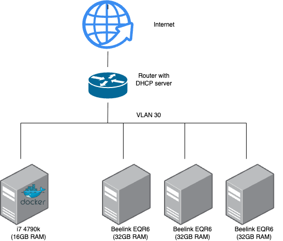
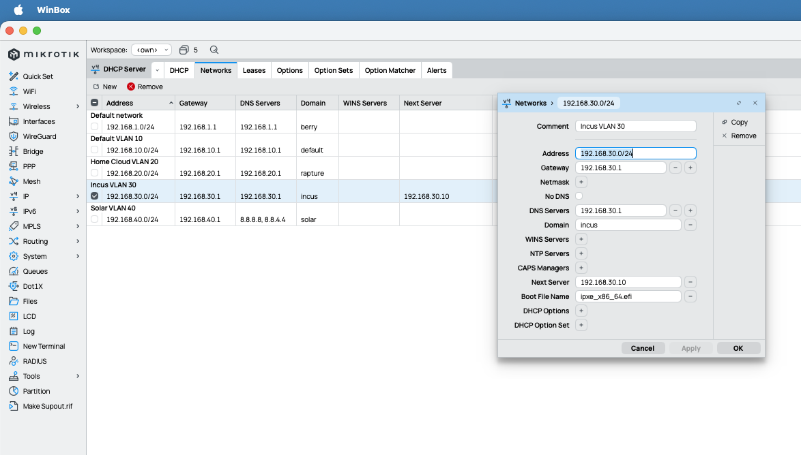

# Containered PXE

If your homelab systems do not have OOB / BMC / IMPI, this is the right place to look at.

## What is this?

This project allows you to easily setup a PXE boot environment with the help of docker containers, so you can network boot and **autoinstall** some machines without user interaction. It is only possible because [iPXE](https://github.com/ipxe/ipxe) exists and it is heavily inspired by [netboot.xyz](https://netboot.xyz/), but has a key difference: You also host the first iPXE config file and you do not rely on the webservice `https://boot.netboot.xyz`.

## Motivation

I have a small homelab that (simplified) looks like this:



As you can guess, the three Beelink machines are my guinea pig systems for e.g. spinning up [proxmox](https://proxmox.com/en/), [kubernetes](https://kubernetes.io/) or [incus](https://linuxcontainers.org/incus/) clusters. I reinstall them often enough that I felt the need to use something more comfortable then running downstairs with a bunch of USB sticks and install every machine manually again and jumping through the installer menus. And since this is consumer hardware without OOB / BMC /IPMI management and I am too stingy for things like [nanoKVM](https://github.com/sipeed/NanoKVM), the only thing left is PXE!

## Usage guide

This will guide you through an autoinstallation for Ubuntu 24.04 with SSH-Key setup, so you can e.g. manage the machine later with ansible.

### 0. Check the requirements

- You understand, that autoinstalling a system overwrites the disk(s) on that system
- You can configure settings in your routers DHCP server - if not, take a look at [other options](#i-cannot-set-custom-settings-on-my-routers-dhcp-server)
- You have a docker host
- You have a machine that is capable of being PXE booted
- You understand that this repo only applies for x86_64 EFI capable systems - if you have something different you have to adopt yourself (please create a PR if you have improvements)

### 1. Build your own EFI image (unfortunately)

You need to build your own EFI image in order to be able to point it to your PXE server IP address **and** port. Luckily, we can also do this inside a docker container.

1. Edit the *efi_image_creator/embed.ipxe* file and put in the IP address of your docker host and desired http port.
2. Build the EFI image. If you are building on a different architecture (e.g. Apple Silicon) builds can take quite some time, my last attempt took 20 minutes. On normal x86_64 it should take around a minute or two.

    ```sh
    cd efi_image_creator
    docker build --platform linux/amd64 -t ipxe-builder .
    docker run --rm --platform linux/amd64 -v "$(pwd)/output:/ipxe/output" ipxe-builder
    cd ..
    ```

    More on why you need to build an own EFI image can be found here: [Why building an own EFI image?](#why-building-an-own-efi-image) and [why a custom port](#why-a-custom-port).

### 2. Spin up the PXE container

1. Copy the efi image from step one into the pxe_images folder

    ```sh
    cp efi_image_creator/output/ipxe_x86_64.efi pxe_images
    ```

2. Modify the *pxe_configs/menu.ipxe* file and change the `srv_ip` to the same IP you used inside the `embed.ipxe` from step1.
3. Modify the *pxe_configs/autoinstall/meta-data* and *pxe_configs/autoinstall/user-data* files to match your desires (e.g. change SSH-Key, etc.)
   1. Hint: To get the NIC names, a manually installed system is helpful to get that information first. Usually the distributions follow a certain pattern.
   2. Hint: this *user-data* file differs from the "usual" ones used in cloud environments. In our case, we fully rely on `autoinstall` which behaves different and has different settings and file structures.
   3. Bonus: If you want to have different configurations for the machines (e.g. different hostnames), you can achieve that by creating folders inside *pxe_configs/autoinstall* which represent the mac address of a certain nic, e.g. `e8ff1ede7ea0`. You paths then would look like *pxe_configs/autoinstall/e8ff1ede7ea0/meta-data* and *pxe_configs/autoinstall/e8ff1ede7ea0/user-data*. Just make sure to also adopt your *pxe_configs/menu.ipxe* file to also use the mac address (section "Autoinstall configuration URL").
4. Change the HTTP port inside the *docker-compose.yml* file if needed and then start the container:

    ```sh
    docker compose up -d
    ```

If you do not want to pull the kernel and initrd file fresh every time from the internet, you can of course put these files into the *pxe_configs* folder and change *pxe_configs/menu.ipxe* accordingly. If you are looking kernel and initrd files from other distributions, take a look at [where to obtain them](#where-do-i-find-the-kernel-and-initrd-files-for-my-distribution).

### 3. Configure your DHCP server

1. Go to the settings of your DHCP server
2. Configure or add a setting for key `next-server` and put in the IP address of the docker host (e.g. `192.168.30.10`)
3. Configure or add a setting for key `boot-file-name` and put in the EFI file name you created (e.g. `ipxe_x86_64.efi`)

Here is an example for a Microtik router:


### 4. Boot the system that is about to be autoinstalled

1. Go to the BIOS and search for the boot settings.
2. Set PXE as the first option.
   1. In my case I had to enable the network stack first in a hard to find menu, otherwise PXE did not show up.
3. Save and reboot.

WARNING: Due to the `late-commands:` setting in the *pxe_configs/autoinstall/user-data* file, the system will now boot to disk instead of booting via PXE, **but** every following reboot, the system will reinstall itself. If this is not desired, do not set PXE as the first boot option but instead, select PXE boot on demand. Depending on your BIOS, you might e.g. use F7 or F8 to enter the boot menu.

## FAQ

### Why building an own EFI image?

The initial EFI image contains the an initial iPXE config file. Of course you could put your whole config inside that and build the image. The drawback is: Every time you want to change or update things, you need to rebuild the image. To circumvent this issue, you can just "chain" additional iPXE config files, by creating an initial config file like this:

```ini
#!ipxe
dhcp
chain http://192.168.30.10:4480/menu.ipxe
```

With this, you can basically dynamically load more iPXE configuration menus from *your own* hosted server. There are existing projects like e.g. [netboot.xyz](https://netboot.xyz/), but if you use their docker container and try to achieve something like full auto-booting a system without prompting you for menu selections, you will quickly notice that this is no longer working. This is because the EFI images netboot.xyz ships in their docker container have an initial iPXE config file that points to their internet presence:

```ini
#!ipxe
dhcp    
chain http://boot.netboot.xyz/menu.ipxe
```

This is awesome to get something up and running for experimenting, but lacks the customizability. If you, on the other hand, use plain netboot.xyz (without docker), you can easily use their ansible tooling to setup your fully self hosted infrastructure by just overwriting the `site_name` and `boot_domain` inside the `user_overrides.yml` file. But I wanted to have my stuff in docker so here we are ^^

### Why a custom port?

First things first: The intentions came from a home-labber and thus are for home labs, where resources and money are always scarce.

You might not have a fancy router that can do VLANs or you might have other services running on that same docker host, which already occupy the "normal" http ports (80, 443) because you have e.g. Nextcloud running there too.
But you have a lot of other ports, so why not use them?

### I cannot set custom settings on my routers DHCP server

I am sorry, but from this point I have to send you to a side-quest. You must disable your router’s DHCP server and set up your own DHCP server (maybe also on the docker host?) to take control of the network. Once you’ve claimed the reins of your IP addresses, return, and you will be rewarded with a bunch more knowledge.

Hint: *Or* you go even one step further and get yourself a router which let's you do all the things, either by flashing your current one with [OpenWRT](https://openwrt.org/) or you buy a cheap Mikrotik hEX series device or some old enterprise hardware second hand.

### Can I use podman instead of docker?

Yes, but there might be caveats: Depending on your setup, your container might need host-network access. If you run podman on a modern M-chip based Macbook, podman technically runs inside a VM and thus has no control over the host network. Be aware of that.

### Which distributions support fully automated installation?

- Ubuntu via cloud-init
- Debian via preseed.cfg
- CentOS/RHEL/Rocky/Alma/Fedora via Kickstart
- openSUSE via autoyast.xml

### Why does the container need host networking?

PXE uses TFTP which listens on port 69/udp for handshake, **but** transfers of the EFI files happen on an random high number udp port, thus we need both the *priviledged* flag and the host network.

Technically, you can avoid the host networking, but you cannot get around the *priviledged* flag:

```docker
---
services:
  containered-pxe:
    image: ghcr.io/berryit/conatinered-pxe:latest
    container_name: conatinered-pxe
    privileged: true
    networks:
      pxe-net:
        ipv4_address: 192.168.30.10
    ports:
      - "69:69/udp"
      - "4480:80"
    volumes:
      - ./pxe_images:/pxe_images
      - ./pxe_configs:/pxe_configs
      #- ./nginx_config:/nginx_config
    restart: unless-stopped

networks:
  pxe-net:
    driver: macvlan
    driver_opts:
      parent: enp2s0
    ipam:
      config:
        - subnet: 192.168.30.0/24
          gateway: 192.168.30.1
          ip_range: 192.168.30.10/32
```

This only works, when the IP address `192.168.30.10` is free to use (so do not configure it on enp2s0).

You can also get creative with this approach: Imagine the docker host has two NICs (eno1 and enp2s0). Now imagine, that eno1 is connected to VLAN 20 (normal devices that should access docker freely) and enp2s0 to VLAN 30 (devices that should autoboot via PXE). This way you can split functionality into different networks while maintaining the services on a single machine.

### Why not DNS instead of a static IP?

You can of course use a DNS name instead of an IP address to point to your PXE container.
IP addresses are just the lowest hanging fruit to get started. When using DNS, just make sure it always points to your docker container.

### My system boots via PXE, but during installation I get prompted from ubuntu

Most likely the installer was not able to reach the `user-data` and `meta-data` files and thus assumes, you are installing manually.

### My system boots via PXE, but the autoinstallation of ubuntu fails

Most likely you get a message with something like "kernel installing error". This is a hint, that your `user-data` file is missing some information or has typos. In general, this part is much more fragile in comparison to normal cloud environments where you also use user-data. Things that are marked as optional in the ubuntu documentation might actually be needed for bare metal. Take the example and build from there.

### Where do I find the kernel and initrd files for my distribution?

In general, you can again use the awesome work from <netboot.xyz> and take a look at <https://github.com/netbootxyz/netboot.xyz/blob/development/roles/netbootxyz/defaults/main.yml>. Note down the `mirror` and `base_dir` variables, as well as the `code_name` for the version you are looking into. Example for Debian:

- *mirror* = `http://deb.debian.org`
- *base_dir* = `debian`
- *code_name* = `trixie`

Now find the matching ipxe menu template, e.g. <https://github.com/netbootxyz/netboot.xyz/blob/development/roles/netbootxyz/templates/menu/debian.ipxe.j2> and search in that file for `:mirrorcfg`. Below that line you will find another line that starts with `set dir`. This is the URL path which is used to fetch the kernel and the initrd files. The variables inside that string can be replaced with the values from before: *debian_base_dir* equals *base_dir*, *debian_version* equals *code_name* and the *os_arch* can be found at the top of that ipxe template (lines 11, 12 and 13; the `set` command at the end of each line).

```ini
#set dir ${debian_base_dir}/dists/${debian_version}/main/installer-${os_arch}/current/images/netboot/
# becomes
set dir debian/dists/trixie/main/installer-amd64/current/images/netboot/
```

Moving further from here, you can follow the `dir` variable and its various places where it is used and repeat the steps by replacing the variables with their real values:

```ini
#set dir ${dir}${menu}-installer/${os_arch}
# becomes
set dir debian/dists/trixie/main/installer-amd64/current/images/netboot/debian-installer/amd64
```

And then ultimately:

```ini
#kernel ${debian_mirror}/${dir}/linux ${install_params} ${netcfg} ${mirrorcfg} {{ kernel_params }}
#initrd ${debian_mirror}/${dir}/initrd.gz
# becomes
kernel http://deb.debian.org/debian/dists/trixie/main/installer-amd64/current/images/netboot/debian-installer/amd64/linux ${install_params} ${netcfg} ${mirrorcfg} {{ kernel_params }}
initrd http://deb.debian.org/debian/dists/trixie/main/installer-amd64/current/images/netboot/debian-installer/amd64/initrd.gz
```

These are the paths where you can find (and fetch) your kernel and initrd files from. From this point, you can replace the `kernel_url` variable in the *pxe_configs/menu.ipxe* that ships with this repository, of course with trimming away the file names (linux, initrd.gz). Repeat everything for the `iso_url` and you should be able to boot a debian instead of an ubuntu.

### I have PXE as the first boot entry, so every reboot my systems reinstall. What could it do?

You could use the curtin command line to modify the efi boot order directly after installation to change it

```yml
late-commands:
  - curtin in-target --target=/target bash -c 'if command -v efibootmgr; then efibootmgr -o $(efibootmgr | grep -i ubuntu | sed -E "s/Boot([0-9A-F]+).*/\1/" | tr -d "\n"); fi'
```

### Statistics

- Building an EFI image on x86_64 hardware: 1-2 minutes
- Building an EFI image on an M2 Macbook air: 20 minutes
- Autoinstalling Ubuntu from cold boot to installation finished (shutdown): 7 minutes
- Autoinstalling Ubuntu from cold boot to ready os: 8 minutes

## Contribute

Any PR is welcomed :)
